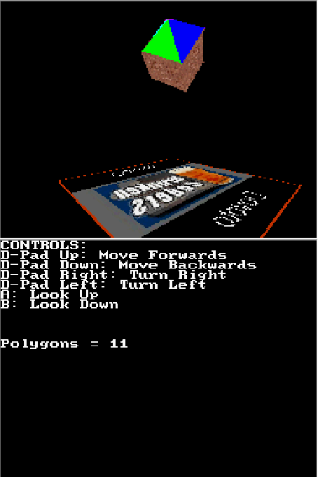

# RocketEngine

## Description:

A 3D game engine built for the NDS.

This is an implementation of a scene graph engine that uses the homebrew version of the Nitendo DS's SDK, libnds.

libnds has it's own implementation of OpenGL ES for interfacing with the nds 3D hardware and it is what this engine uses to render the given objects.

## How to run:

You can run the demo of the engine with RocketEngine.nds.

The RocketEngine.nds binary can be run using a NDS emulator such as DeSmuME or NO$GBA.

If you want to create our own game using the engine you can build it using make.
